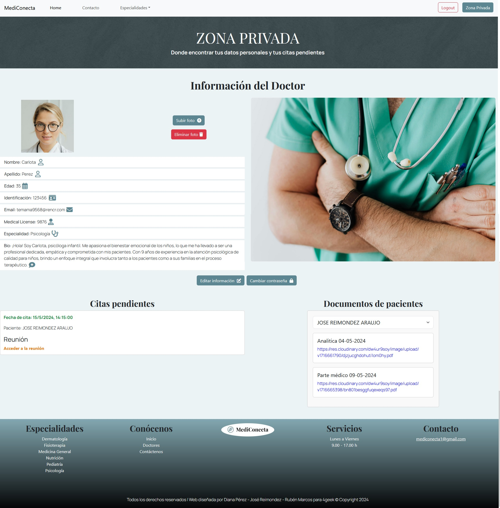
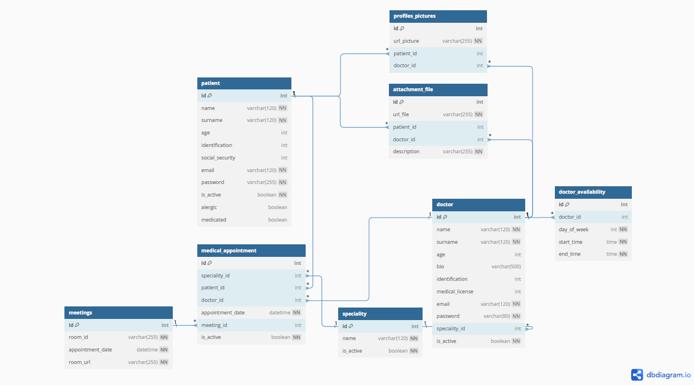

# 🩺 MEDICONECTA 

Mediconecta es una plataforma web innovadora destinada a la gestión de citas médicas que incluye funcionalidades avanzadas como envío de emails automáticos, recuperación de contraseña, gestión documental y videoconferencias médicas.

## 🚀 Características Principales

- Sistema de gestión de citas médicas online
- Envío automático de emails para confirmaciones y recordatorios
- Videoconferencias médicas integradas con Whereby
- Sistema de gestión documental seguro
- Perfiles diferenciados para médicos y pacientes
- Recuperación de contraseña automatizada
- Diseño completamente responsive

## 🛠 Tecnologías Utilizadas

- **Frontend**
  - React.js
  - Bootstrap
  - HTML5
  - CSS3
  - JavaScript/ES6+

- **Backend**
  - Python
  - SQLAlchemy
  - Flask

- **Servicios**
  - Cloudinary (gestión de archivos)
  - Whereby (videoconferencias)
  - Sistemas de email automatizado

- **Diseño**
  - Figma

## 🏥 Funcionalidades Detalladas

### HOME
- Resumen general de servicios
- Listado de especialidades médicas
- Presentación del equipo médico
- Información de contacto

### GESTIÓN DE USUARIOS
- **Registro y Autenticación**
  - Registro diferenciado para pacientes y médicos
  - Email de bienvenida automático
  - Sistema de recuperación de contraseña
  - Gestión de perfil personal

### ESPECIALIDADES MÉDICAS
- Catálogo de servicios médicos
- Información detallada de especialidades
- Acceso directo a profesionales por especialidad

### SISTEMA DE CITAS
- Reserva de citas online
- Recordatorios por email automáticos
- Acceso directo a consulta virtual
- Gestión de calendario médico

### GESTIÓN DOCUMENTAL
- Carga segura de documentos médicos
- Acceso controlado a historiales
- Compartición segura entre paciente y médico

### SEGURIDAD
- Autenticación robusta
- Acceso controlado a perfiles
- Protección de datos médicos
- Cumplimiento de normativas de privacidad

## 📱 Interfaces de Usuario

### Portal del Paciente

- Gestión de citas médicas
- Acceso a documentación
- Historial de consultas
- Videoconferencias

### Portal del Médico

- Gestión de agenda
- Acceso a historiales
- Consultas virtuales
- Gestión documental

## 🎥 Demostración

## 📊 Estructura del Proyecto

## 👥 Autores

- 👨🏻‍💻 [@RubenMP](https://github.com/rubenmp92) - Desarrollo Backend
- 🦊 [@DianaPF](https://github.com/KitsuneDai) - Diseño UI/UX
- 👨🏽‍💻 [@JoseRA](https://github.com/josereimondez29) - Desarrollo Frontend

## 📝 Licencia

Este proyecto está bajo la Licencia MIT. Ver el archivo `LICENSE` para más detalles.

---
⌨️ Desarrollado con ❤️ por el equipo de MediConecta